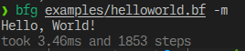

# bfg
a silly brainfuck interpreter i made in c#

> ![WARNING]
> as always, this may not work at all, please report any issues ;)
 
# how it works
it works just like any other bf interpreter!  

## comments
bfg supports comments prefixed with `#`
#### comments: do's and dont's
```
✅: # this code: ++++++++[>++++++++<-]>.+. wont be exeucted.
❌: hi! this is a comment, but without the prefix. (, and . get parsed)

✅: +++ # this is a correct inline commment    
❌: +++ this is an inline comment (would work, but this is not recommended)
❌: +++ this is another inline comment. (breaks things - . gets parsed)
```

## syntax
`bfg <file> [--show-memory | --meta | --num | --max-steps]`  

`file`: the file to run  
`--show-memory`: whether to show the modified cells after execution  
`--meta` (or `-m`): whether to show time and steps after execution  
`--num` (or `-n`): whether to output numbers instead of letters  
`--max-steps`: the amount of steps a program can do before throwing an error (defaults to `-1 (infinite)`)

# download
download an executable from the [Releases](/tjf1dev/bfg/releases) page.
### windows
download the `bfg.exe` file, then run it in the terminal (like `bfg.exe examples/helloworld.bf`)
### linux
download the `bfg` (without .exe) then run it in the terminal (like `bfg examples/helloworld.bf`)

### other
i didnt try any other platforms so build it yourself ig 😭

# build
install the .NET SDK first
```
git clone https://github.com/tjf1dev/bfg
cd bfg
dotnet run examples/helloworld.bf -- -m
```
